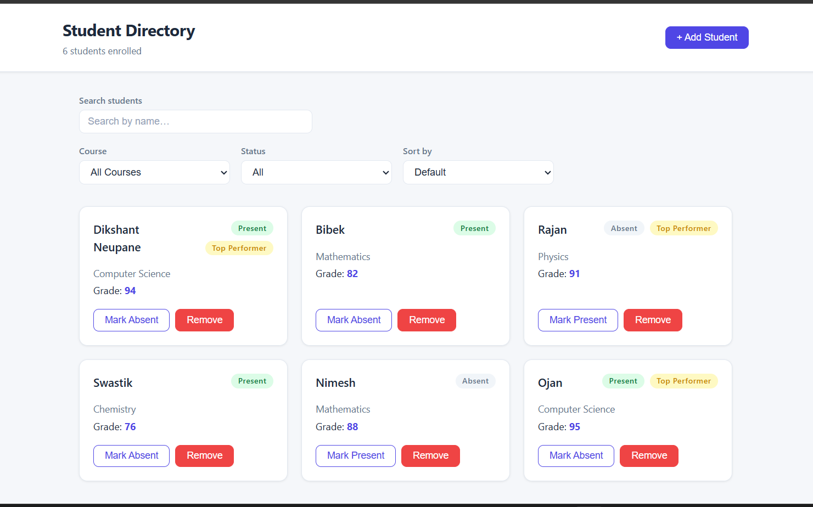

# Student Directory

An interactive student directory built with React and plain CSS. Manage students, track attendance, search and filter by course or status, and sort by name or grade — all in a clean, responsive UI.

**Live Demo:** https://samriddhicollegestudent.web.app

---

## Screenshots



---

## Setup Steps

**1. Clone the repository**
```bash
git clone <your-repo-url>
cd student-directory
```

**2. Install dependencies**
```bash
npm install
```

**3. Start the development server**
```bash
npm run dev
```

**4. Open in your browser**

Visit `http://localhost:5173`

**5. Build for production**
```bash
npm run build
```

---

## Features

- **View Students** — students are displayed in a responsive 3-column card grid
- **Add Student** — fill out a form (name, course, grade) to add a new student; form validates required fields and grade range (0–100)
- **Search** — filter students by name in real time
- **Filter by Course** — narrow the list to a specific course
- **Filter by Status** — show only Present or Absent students
- **Sort** — sort by name (A–Z) or grade (high to low / low to high)
- **Toggle Attendance** — mark any student Present or Absent with one click
- **Remove Student** — delete a student from the directory
- **Top Performer Badge** — students with grade ≥ 90 automatically receive a "Top Performer" badge
- **Empty States** — friendly messages when no students exist or no search results match
- **LocalStorage** — student data persists across page refreshes automatically
- **Responsive Design** — works on mobile, tablet, and desktop

---

## Tech Stack

| Tool | Purpose |
|------|---------|
| React 19 | UI library |
| Vite | Build tool / dev server |
| Plain CSS | Styling (CSS variables, grid, flexbox) |
| localStorage | Client-side persistence |
| Firebase Hosting | Deployment |

---

## Project Structure

```
src/
  App.jsx              # Root component — state, logic, layout
  App.css              # Global styles and layout
  components/
    StudentCard.jsx    # Card component for each student
    StudentCard.css    # Card styles + animations
    Button.jsx         # Reusable button (primary / outline / danger)
    Badge.jsx          # Reusable badge (success / neutral / warning)
    Input.jsx          # Labeled input component
    components.css     # Shared component styles + CSS variables
```
